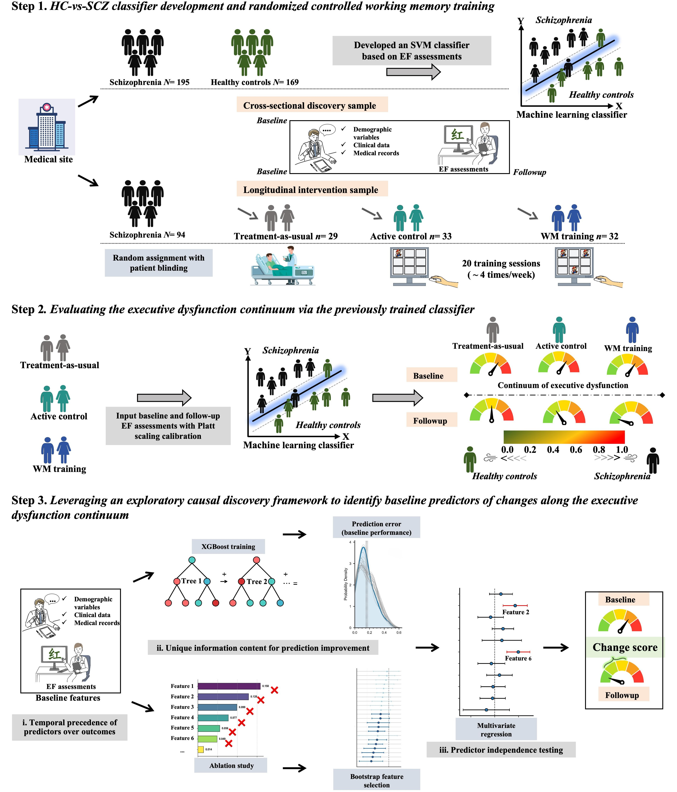

# Working Memory Training in Schizophrenia: A Machine Learning Approach

This repository contains the source code for our paper "Rethinking the Effects of Working Memory Training on Executive Functions in Schizophrenia: A Machine Learning Approach," published in *International Journal of Clinical and Health Psychology*.

*Figure 1. Schematic diagram of the study design and analysis pipelines.*

---

## Abstract

**Background:** Executive dysfunction in schizophrenia profoundly impairs functional outcomes and remains insufficiently addressed by standard pharmacological treatments. While computerized cognitive training offers promise, traditional evaluation methods often fail to capture nuanced improvements along the psychosis-health continuum. This study aims to quantify executive function (EF) profile changes following cognitive training and identify robust baseline predictors of treatment response.

**Methods:** Ninety-four schizophrenia patients were randomized to adaptive N-back training (n = 32), non-adaptive 1-back control (n = 33), or treatment-as-usual (n = 29). EF was assessed across working memory, cognitive flexibility, and inhibitory control domains. A support vector machine classifier, trained on an independent sample (195 patients, 169 controls) and calibrated via Platt scaling, quantified EF profile changes. An exploratory framework based on Granger causality principles identified baseline treatment predictors.

**Results:** Adaptive training produced significant near-transfer effects on untrained working memory tasks and reduced general psychopathology (pfdr < 0.05), but no far-transfer effects to other EF domains. The probability of neurotypical EF classification increased substantially in the adaptive group (13.21% to 38.79%, p < 0.001), correlating with symptom reduction. Working memory maintenance and response inhibition emerged as the most robust baseline predictors of treatment response.

**Conclusions:** Working memory training induces meaningful shifts in EF profiles in schizophrenia, promoting movement along the psychosis-health continuum toward neurotypical functioning. The classifier-based approach provides a more refined assessment compared to traditional binary measures, while the exploratory framework identifies specific EF domains predicting treatment response with potential causal relevance. These findings warrant validation through larger, multi-center trials with extended follow-up periods.

**Keywords:** Schizophrenia; Working memory training; Executive functions; Machine learning; Support vector machine; Treatment response prediction

---

## Citation

Zhang, T., Su, M., Huo, X., & Zhao, X. (2025). Rethinking the Effects of Working Memory Training on Executive Functions in Schizophrenia: A Machine Learning Approach (SSRN Scholarly Paper No. 5277353). *Social Science Research Network*. https://doi.org/10.2139/ssrn.5277353

**Note:** This manuscript is currently under review at *International Journal of Clinical and Health Psychology*.
